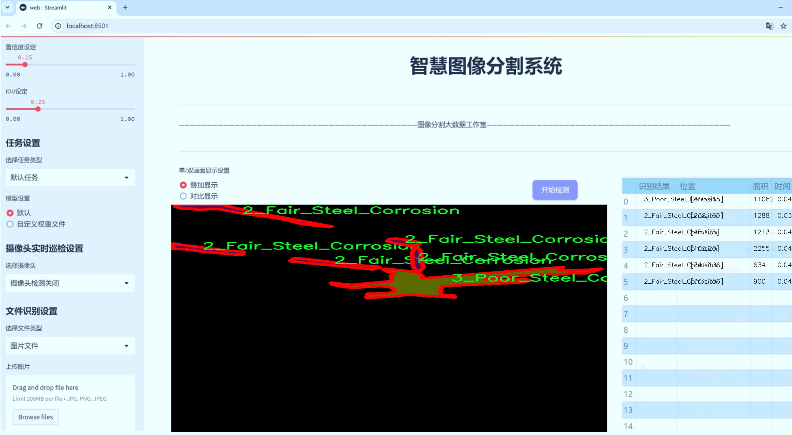
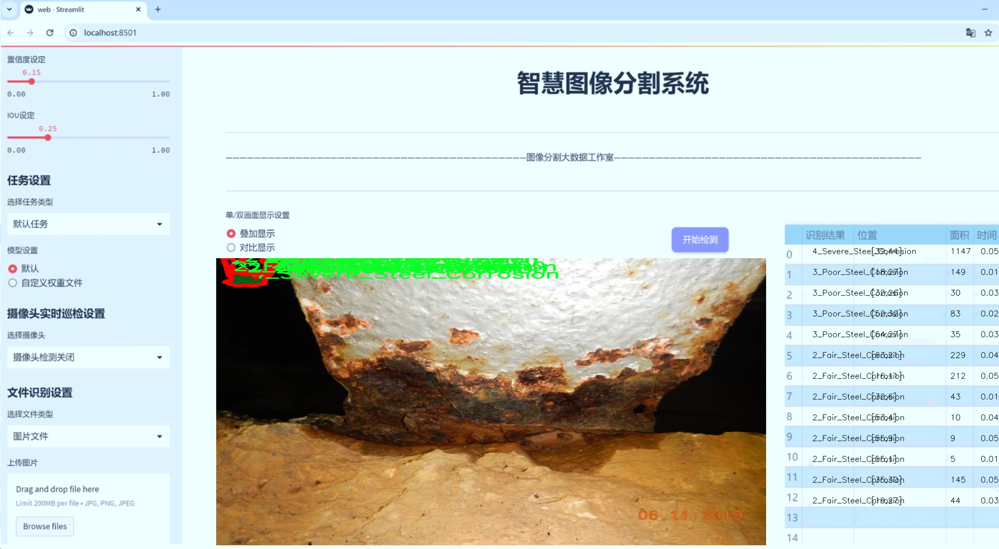
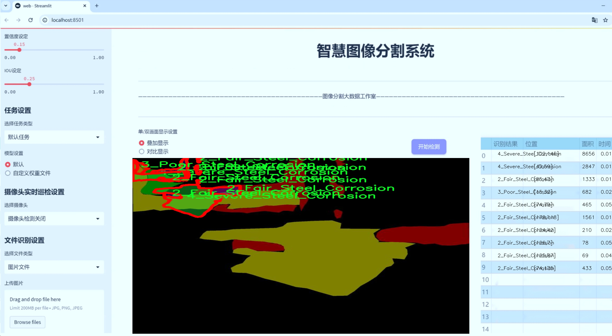
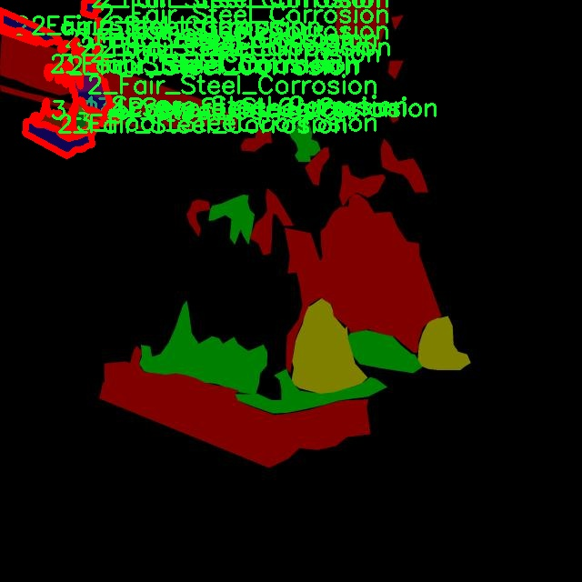
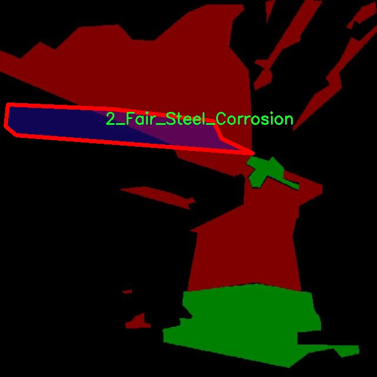
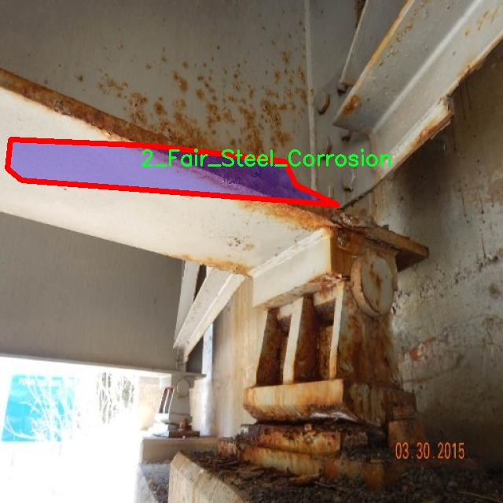
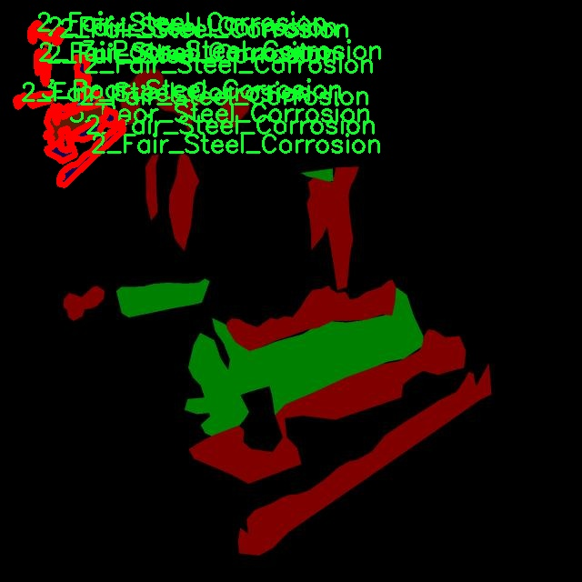
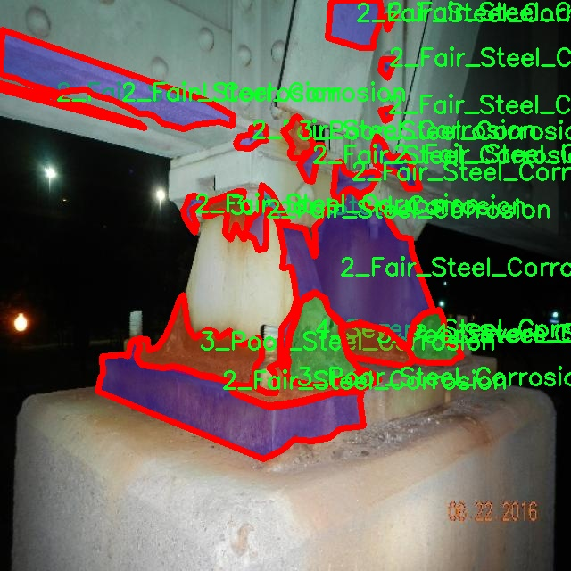

# 钢铁腐蚀图像分割系统源码＆数据集分享
 [yolov8-seg-C2f-DCNV2＆yolov8-seg-C2f-Faster等50+全套改进创新点发刊_一键训练教程_Web前端展示]

### 1.研究背景与意义

项目参考[ILSVRC ImageNet Large Scale Visual Recognition Challenge](https://gitee.com/YOLOv8_YOLOv11_Segmentation_Studio/projects)

项目来源[AAAI Global Al lnnovation Contest](https://kdocs.cn/l/cszuIiCKVNis)

研究背景与意义

随着工业化进程的加快，钢铁材料在各类工程和基础设施中的应用愈加广泛。然而，钢铁腐蚀问题却成为制约其使用寿命和安全性的主要因素之一。腐蚀不仅导致经济损失，还可能引发严重的安全隐患。因此，及时、准确地检测和评估钢铁腐蚀状况显得尤为重要。传统的腐蚀检测方法多依赖人工检查和简单的图像处理技术，存在效率低、主观性强和精度不足等问题。近年来，随着计算机视觉和深度学习技术的迅猛发展，基于图像的自动化腐蚀检测方法逐渐成为研究热点。

在众多深度学习模型中，YOLO（You Only Look Once）系列因其出色的实时检测能力和高效的图像处理性能而受到广泛关注。YOLOv8作为该系列的最新版本，进一步提升了检测精度和速度，尤其在复杂场景下的目标检测表现优异。然而，针对钢铁腐蚀图像的特定需求，YOLOv8仍存在一定的局限性。钢铁腐蚀的形态多样，且不同程度的腐蚀状态在图像中表现出不同的特征，这对模型的分割能力提出了更高的要求。因此，基于改进YOLOv8的钢铁腐蚀图像分割系统的研究具有重要的理论价值和实际意义。

本研究所使用的数据集包含1800幅钢铁腐蚀图像，涵盖了三种腐蚀类别：轻度腐蚀、中度腐蚀和严重腐蚀。这一数据集的构建为模型的训练和评估提供了丰富的样本基础。通过对不同腐蚀程度的图像进行实例分割，能够帮助模型更好地理解和识别腐蚀特征，从而提高检测的准确性和鲁棒性。此外，针对腐蚀图像的实例分割任务，不仅需要对腐蚀区域进行精确定位，还需对其进行分类，这为模型的设计和优化提出了新的挑战。

本研究的意义在于，首先，通过改进YOLOv8模型，能够有效提升钢铁腐蚀图像的分割精度，为后续的腐蚀评估和维护决策提供科学依据。其次，基于深度学习的自动化检测系统将大幅提高钢铁腐蚀检测的效率，降低人工成本，推动智能化检测技术在工业领域的应用。此外，本研究还将为相关领域的研究者提供参考，促进钢铁腐蚀检测技术的进一步发展。

综上所述，基于改进YOLOv8的钢铁腐蚀图像分割系统的研究，不仅具有重要的学术价值，还将为实际工程应用提供切实可行的解决方案，推动钢铁材料的安全使用和维护管理。通过本研究的深入开展，有望为钢铁腐蚀的监测与管理提供新的思路和方法，助力相关行业的可持续发展。

### 2.图片演示







##### 注意：由于此博客编辑较早，上面“2.图片演示”和“3.视频演示”展示的系统图片或者视频可能为老版本，新版本在老版本的基础上升级如下：（实际效果以升级的新版本为准）

  （1）适配了YOLOV8的“目标检测”模型和“实例分割”模型，通过加载相应的权重（.pt）文件即可自适应加载模型。

  （2）支持“图片识别”、“视频识别”、“摄像头实时识别”三种识别模式。

  （3）支持“图片识别”、“视频识别”、“摄像头实时识别”三种识别结果保存导出，解决手动导出（容易卡顿出现爆内存）存在的问题，识别完自动保存结果并导出到tempDir中。

  （4）支持Web前端系统中的标题、背景图等自定义修改，后面提供修改教程。

  另外本项目提供训练的数据集和训练教程,暂不提供权重文件（best.pt）,需要您按照教程进行训练后实现图片演示和Web前端界面演示的效果。

### 3.视频演示

[3.1 视频演示](https://www.bilibili.com/video/BV1z5SjYGEBr/)

### 4.数据集信息展示

##### 4.1 本项目数据集详细数据（类别数＆类别名）

nc: 3
names: ['2_Fair_Steel_Corrosion', '3_Poor_Steel_Corrosion', '4_Severe_Steel_Corrosion']


##### 4.2 本项目数据集信息介绍

数据集信息展示

在现代工业生产中，钢铁材料的腐蚀问题日益严重，直接影响到结构的安全性和耐用性。因此，开发高效的图像分割系统以准确识别和分类不同程度的钢铁腐蚀，成为了材料科学和计算机视觉领域的重要研究方向。本研究采用的数据集名为“Corrosion”，旨在为改进YOLOv8-seg模型提供高质量的训练数据，以实现对钢铁腐蚀图像的精确分割和分类。

“Corrosion”数据集包含三种主要的腐蚀类别，分别是“2_Fair_Steel_Corrosion”、“3_Poor_Steel_Corrosion”和“4_Severe_Steel_Corrosion”。这些类别的划分不仅反映了腐蚀的严重程度，还为后续的图像分析提供了丰富的语义信息。具体而言，“2_Fair_Steel_Corrosion”代表着轻微的腐蚀状态，通常表现为表面轻微的锈斑或氧化现象，尚未对钢铁的结构完整性造成显著影响；“3_Poor_Steel_Corrosion”则指示中等程度的腐蚀，可能伴随有较为明显的锈蚀和表面剥落，结构的安全性开始受到威胁；而“4_Severe_Steel_Corrosion”则标志着严重的腐蚀状态，通常表现为大面积的锈蚀和结构损坏，亟需采取措施进行修复或更换。

数据集的构建过程经过严格的筛选和标注，确保每一幅图像都能准确反映其对应的腐蚀类别。数据集中的图像来源于实际的工业环境，涵盖了不同光照、角度和背景下的钢铁腐蚀实例，极大地丰富了模型的训练样本。为了提高模型的泛化能力，数据集还进行了数据增强处理，包括旋转、缩放、翻转等操作，使得模型在面对各种复杂情况时能够保持良好的识别性能。

在训练过程中，YOLOv8-seg模型将利用“Corrosion”数据集中的图像及其对应的标签进行学习，通过深度学习算法提取图像特征，逐步优化其分割性能。模型将能够在实时监测中，快速识别出不同程度的钢铁腐蚀，提供可靠的决策支持。这一系统的成功实现，将为工业界提供一种高效的检测手段，降低维护成本，提高设备的安全性和可靠性。

综上所述，“Corrosion”数据集不仅为钢铁腐蚀图像分割系统的训练提供了坚实的基础，也为后续的研究和应用开辟了新的方向。通过对不同腐蚀状态的准确识别和分类，研究者能够更深入地理解腐蚀机制，进而制定更为有效的防护措施，推动钢铁材料的科学管理与应用。











### 5.全套项目环境部署视频教程（零基础手把手教学）

[5.1 环境部署教程链接（零基础手把手教学）](https://www.bilibili.com/video/BV1jG4Ve4E9t/?vd_source=bc9aec86d164b67a7004b996143742dc)


[5.2 安装Python虚拟环境创建和依赖库安装视频教程链接（零基础手把手教学）](https://www.bilibili.com/video/BV1nA4VeYEze/?vd_source=bc9aec86d164b67a7004b996143742dc)

### 6.手把手YOLOV8-seg训练视频教程（零基础小白有手就能学会）

[6.1 手把手YOLOV8-seg训练视频教程（零基础小白有手就能学会）](https://www.bilibili.com/video/BV1cA4VeYETe/?vd_source=bc9aec86d164b67a7004b996143742dc)


按照上面的训练视频教程链接加载项目提供的数据集，运行train.py即可开始训练



     Epoch   gpu_mem       box       obj       cls    labels  img_size
     1/200     0G   0.01576   0.01955  0.007536        22      1280: 100%|██████████| 849/849 [14:42<00:00,  1.04s/it]
               Class     Images     Labels          P          R     mAP@.5 mAP@.5:.95: 100%|██████████| 213/213 [01:14<00:00,  2.87it/s]
                 all       3395      17314      0.994      0.957      0.0957      0.0843

     Epoch   gpu_mem       box       obj       cls    labels  img_size
     2/200     0G   0.01578   0.01923  0.007006        22      1280: 100%|██████████| 849/849 [14:44<00:00,  1.04s/it]
               Class     Images     Labels          P          R     mAP@.5 mAP@.5:.95: 100%|██████████| 213/213 [01:12<00:00,  2.95it/s]
                 all       3395      17314      0.996      0.956      0.0957      0.0845

     Epoch   gpu_mem       box       obj       cls    labels  img_size
     3/200     0G   0.01561    0.0191  0.006895        27      1280: 100%|██████████| 849/849 [10:56<00:00,  1.29it/s]
               Class     Images     Labels          P          R     mAP@.5 mAP@.5:.95: 100%|███████   | 187/213 [00:52<00:00,  4.04it/s]
                 all       3395      17314      0.996      0.957      0.0957      0.0845


### 7.50+种全套YOLOV8-seg创新点代码加载调参视频教程（一键加载写好的改进模型的配置文件）

[7.1 50+种全套YOLOV8-seg创新点代码加载调参视频教程（一键加载写好的改进模型的配置文件）](https://www.bilibili.com/video/BV1Hw4VePEXv/?vd_source=bc9aec86d164b67a7004b996143742dc)

### 8.YOLOV8-seg图像分割算法原理

原始YOLOv8-seg算法原理

YOLOv8-seg算法是目标检测和分割领域的最新进展，其核心思想是将YOLO系列的高效目标检测能力与图像分割的精细化处理相结合，形成了一种新的多任务学习框架。该算法在YOLOv5和YOLOv7的基础上进行了多项创新和改进，尤其是在网络结构、特征提取、损失函数以及样本匹配策略等方面，极大地提升了模型的性能和适用性。

首先，YOLOv8-seg算法的网络结构依然遵循YOLO系列的经典设计，包括输入层、主干网络（Backbone）、特征融合层（Neck）和输出层（Head）。在主干网络方面，YOLOv8采用了CSPDarknet的思想，并引入了C2f模块来替代YOLOv5中的C3模块。C2f模块的设计灵感来源于ELAN结构，通过引入多个shortcut连接，显著缓解了深层网络中的梯度消失问题，同时增强了浅层特征的重用能力。这种设计使得YOLOv8在保持轻量化的同时，能够有效提取图像中的重要特征。

在特征融合层，YOLOv8采用了PAN-FPN结构，这一结构能够有效地进行多尺度特征的融合。通过自下而上的高层特征与中层、浅层特征的融合，YOLOv8能够更好地捕捉到不同尺度目标的信息。具体而言，特征融合过程通过上采样和Concat操作，将高层特征与中层特征结合，并进一步与浅层特征进行加和，确保每一层特征图都包含丰富的语义信息和细节信息。这种多尺度特征融合的策略极大地提高了目标检测的精度和鲁棒性。

在输出层，YOLOv8引入了Anchor-Free的思想，取消了传统的Anchor-Base方法，采用了更为灵活的解耦头结构。该结构将分类和回归任务分开处理，分别输出目标的类别和边界框信息。通过使用Distribution Focal Loss作为回归损失函数，YOLOv8能够更好地处理样本不平衡的问题，尤其是在目标较小或数量较少的情况下，确保模型能够有效学习到这些难以识别的目标。

YOLOv8-seg算法在样本匹配策略上也进行了创新，采用了Task-Aligned的Assigner匹配方式。这种动态匹配策略能够根据任务的需求，灵活调整样本的匹配方式，从而提高模型的训练效率和准确性。此外，YOLOv8在数据预处理方面借鉴了YOLOv5的策略，采用了多种数据增强手段，如马赛克增强、混合增强、空间扰动和颜色扰动等，以提高模型的泛化能力。

在损失函数的设计上，YOLOv8引入了VFLLoss和DFLLoss+CIoULoss的组合，这一组合不仅提高了分类的准确性，还增强了边界框回归的精度。VFLLoss通过引入聚焦因子，有效解决了正负样本不平衡的问题，使得模型在训练过程中能够更加关注难以分类的样本。而CIoULoss则通过考虑边界框的重叠度、中心点距离和宽高比等多个因素，进一步提升了边界框的回归精度。

YOLOv8-seg算法的整体设计理念是通过深度学习的多任务学习框架，将目标检测与图像分割相结合，形成一种高效、精确的目标识别系统。其网络结构的灵活性和特征提取的高效性，使得YOLOv8在处理复杂场景和多种目标时，能够展现出优异的性能。通过对特征的深度融合和动态样本匹配，YOLOv8不仅提高了目标检测的精度，还增强了模型在实际应用中的适应性和鲁棒性。

综上所述，YOLOv8-seg算法通过对传统YOLO系列的创新与改进，形成了一种全新的目标检测与分割框架。其在网络结构、特征融合、损失函数和样本匹配等方面的突破，使得YOLOv8在目标检测和图像分割任务中，能够实现更高的精度和更快的速度，展现出强大的应用潜力和广泛的适用性。随着YOLOv8-seg算法的不断发展和完善，未来在智能监控、自动驾驶、医疗影像等领域的应用前景将更加广阔。


### 9.系统功能展示（检测对象为举例，实际内容以本项目数据集为准）

图9.1.系统支持检测结果表格显示

  图9.2.系统支持置信度和IOU阈值手动调节

  图9.3.系统支持自定义加载权重文件best.pt(需要你通过步骤5中训练获得)

  图9.4.系统支持摄像头实时识别

  图9.5.系统支持图片识别

  图9.6.系统支持视频识别

  图9.7.系统支持识别结果文件自动保存

  图9.8.系统支持Excel导出检测结果数据


### 10.50+种全套YOLOV8-seg创新点原理讲解（非科班也可以轻松写刊发刊，V11版本正在科研待更新）

#### 10.1 由于篇幅限制，每个创新点的具体原理讲解就不一一展开，具体见下列网址中的创新点对应子项目的技术原理博客网址【Blog】：


[10.1 50+种全套YOLOV8-seg创新点原理讲解链接](https://gitee.com/qunmasj/good)

#### 10.2 部分改进模块原理讲解(完整的改进原理见上图和技术博客链接)【如果此小节的图加载失败可以通过CSDN或者Github搜索该博客的标题访问原始博客，原始博客图片显示正常】
### YOLOv8简介
YOLOv8 尚未发表论文，因此我们无法直接了解其创建过程中进行的直接研究方法和消融研究。话虽如此，我们分析了有关模型的存储库和可用信息，以开始记录 YOLOv8 中的新功能。

如果您想自己查看代码，请查看YOLOv8 存储库并查看此代码差异以了解一些研究是如何完成的。

在这里，我们提供了有影响力的模型更新的快速总结，然后我们将查看模型的评估，这不言自明。

GitHub 用户 RangeKing 制作的下图显示了网络架构的详细可视化。


在这里插入图片描述


在这里插入图片描述

YOLOv8 架构，GitHub 用户 RangeKing 制作的可视化

无锚检测
YOLOv8 是一个无锚模型。这意味着它直接预测对象的中心而不是已知锚框的偏移量。


YOLO中anchor box的可视化

锚框是早期 YOLO 模型中众所周知的棘手部分，因为它们可能代表目标基准框的分布，而不是自定义数据集的分布。


YOLOv8 的检测头，在netron.app中可视化

Anchor free 检测减少了框预测的数量，从而加速了非最大抑制 (NMS)，这是一个复杂的后处理步骤，在推理后筛选候选检测。


YOLOv8 的检测头，在netron.app中可视化

新的卷积
stem 的第一个6x6conv 被替换为 a 3x3，主要构建块被更改，并且C2f替换了C3。该模块总结如下图，其中“f”是特征数，“e”是扩展率，CBS是由a Conv、a BatchNorm、a组成的block SiLU。

在中， （两个具有剩余连接的 3x3C2f的奇特名称）的所有输出都被连接起来。而在仅使用最后一个输出。Bottleneck``convs``C3``Bottleneck


新的 YOLOv8C2f模块

这Bottleneck与 YOLOv5 中的相同，但第一个 conv 的内核大小从更改1x1为3x3. 从这些信息中，我们可以看到 YOLOv8 开始恢复到 2015 年定义的 ResNet 块。

在颈部，特征直接连接而不强制使用相同的通道尺寸。这减少了参数数量和张量的整体大小。

### 空间和通道重建卷积SCConv
参考该博客提出的一种高效的卷积模块，称为SCConv (spatial and channel reconstruction convolution)，以减少冗余计算并促进代表性特征的学习。提出的SCConv由空间重构单元(SRU)和信道重构单元(CRU)两个单元组成。

（1）SRU根据权重分离冗余特征并进行重构，以抑制空间维度上的冗余，增强特征的表征。

（2）CRU采用分裂变换和融合策略来减少信道维度的冗余以及计算成本和存储。

（3）SCConv是一种即插即用的架构单元，可直接用于替代各种卷积神经网络中的标准卷积。实验结果表明，scconvo嵌入模型能够通过减少冗余特征来获得更好的性能，并且显著降低了复杂度和计算成本。


SCConv如图所示，它由两个单元组成，空间重建单元(SRU)和通道重建单元(CRU)，以顺序的方式放置。具体而言，对于瓶颈残差块中的中间输入特征X，首先通过SRU运算获得空间细化特征Xw，然后利用CRU运算获得信道细化特征Y。SCConv模块充分利用了特征之间的空间冗余和通道冗余，可以无缝集成到任何CNN架构中，以减少中间特征映射之间的冗余并增强CNN的特征表示。

#### SRU单元用于空间冗余


为了利用特征的空间冗余，引入了空间重构单元(SRU)，如图2所示，它利用了分离和重构操作。

分离操作 的目的是将信息丰富的特征图与空间内容对应的信息较少的特征图分离开来。我们利用组归一化(GN)层中的比例因子来评估不同特征图的信息内容。具体来说，给定一个中间特征映射X∈R N×C×H×W，首先通过减去平均值µ并除以标准差σ来标准化输入特征X，如下所示:


其中µ和σ是X的均值和标准差，ε是为了除法稳定性而加入的一个小的正常数，γ和β是可训练的仿射变换。

GN层中的可训练参数\gamma \in R^{C}用于测量每个批次和通道的空间像素方差。更丰富的空间信息反映了空间像素的更多变化，从而导致更大的γ。归一化相关权重W_{\gamma} \in R^{C}由下面公式2得到，表示不同特征映射的重要性。


然后将经Wγ重新加权的特征映射的权值通过sigmoid函数映射到(0,1)范围，并通过阈值进行门控。我们将阈值以上的权重设置为1，得到信息权重W1，将其设置为0，得到非信息权重W2(实验中阈值设置为0.5)。获取W的整个过程可以用公式表示。


最后将输入特征X分别乘以W1和W2，得到两个加权特征:信息量较大的特征X_{1}^{\omega }和信息量较小的特征X_{2}^{\omega }。这样就成功地将输入特征分为两部分:X_{1}^{\omega }具有信息量和表达性的空间内容，而X_{2}^{\omega }几乎没有信息，被认为是冗余的。

重构操作 将信息丰富的特征与信息较少的特征相加，生成信息更丰富的特征，从而节省空间空间。采用交叉重构运算，将加权后的两个不同的信息特征充分结合起来，加强它们之间的信息流。然后将交叉重构的特征X^{\omega1}和X^{\omega2}进行拼接，得到空间精细特征映射X^{\omega}。从后过程表示如下：


其中⊗是逐元素的乘法，⊕是逐元素的求和，∪是串联。将SRU应用于中间输入特征X后，不仅将信息特征与信息较少的特征分离，而且对其进行重构，增强代表性特征，抑制空间维度上的冗余特征。然而，空间精细特征映射X^{\omega}在通道维度上仍然是冗余的。

#### CRU单元用于通道冗余


分割 操作将输入的空间细化特征X^{\omega}分割成两个部分，一部分通道数是\alpha C，另一部分通道数是(1-\alpha) C，随后对两组特征的通道数使用1 * 1卷积核进行压缩，分别得到X_{up}和X_{low}。

转换 操作将输入的X_{up}作为“富特征提取”的输入，分别进行GWC和PWC，然后相加得到输出Y1，将输入X_{low}作为“富特征提取”的补充，进行PWC，得到的记过和原来的输入取并集得到Y2。

融合 操作使用简化的SKNet方法来自适应合并Y1和Y2。具体说是首先使用全局平均池化将全局空间信息和通道统计信息结合起来，得到经过池化的S1和S2。然后对S1和S2做Softmax得到特征权重向量\beta _{1}和\beta _{2}，最后使用特征权重向量得到输出Y = \beta _{1}*Y_{1} + \beta _{2}*Y_{2}，Y即为通道提炼的特征。


### 11.项目核心源码讲解（再也不用担心看不懂代码逻辑）

#### 11.1 ultralytics\nn\modules\head.py

以下是经过简化和注释的核心代码，保留了YOLOv8模型的主要部分，包括检测、分割、姿态估计和分类的头部模块。代码中添加了详细的中文注释，以帮助理解每个部分的功能。

```python
import torch
import torch.nn as nn
from .conv import Conv
from .utils import bias_init_with_prob, linear_init_

class Detect(nn.Module):
    """YOLOv8 检测头，用于目标检测模型。"""
    
    def __init__(self, nc=80, ch=()):
        """初始化 YOLOv8 检测层，指定类别数和通道数。"""
        super().__init__()
        self.nc = nc  # 类别数
        self.nl = len(ch)  # 检测层数
        self.reg_max = 16  # DFL 通道数
        self.no = nc + self.reg_max * 4  # 每个锚点的输出数
        self.stride = torch.zeros(self.nl)  # 在构建时计算的步幅
        c2, c3 = max((16, ch[0] // 4, self.reg_max * 4)), max(ch[0], min(self.nc, 100))  # 通道数
        # 定义两个卷积序列，cv2用于回归，cv3用于分类
        self.cv2 = nn.ModuleList(
            nn.Sequential(Conv(x, c2, 3), Conv(c2, c2, 3), nn.Conv2d(c2, 4 * self.reg_max, 1)) for x in ch)
        self.cv3 = nn.ModuleList(nn.Sequential(Conv(x, c3, 3), Conv(c3, c3, 3), nn.Conv2d(c3, self.nc, 1)) for x in ch)

    def forward(self, x):
        """连接并返回预测的边界框和类别概率。"""
        shape = x[0].shape  # BCHW
        for i in range(self.nl):
            x[i] = torch.cat((self.cv2[i](x[i]), self.cv3[i](x[i])), 1)  # 连接回归和分类的输出

        x_cat = torch.cat([xi.view(shape[0], self.no, -1) for xi in x], 2)  # 合并所有层的输出
        box, cls = x_cat.split((self.reg_max * 4, self.nc), 1)  # 分割出边界框和类别
        dbox = self.dfl(box)  # 处理边界框
        y = torch.cat((dbox, cls.sigmoid()), 1)  # 合并边界框和类别概率
        return y

class Segment(Detect):
    """YOLOv8 分割头，用于分割模型。"""

    def __init__(self, nc=80, nm=32, ch=()):
        """初始化 YOLO 模型属性，如掩码数、原型数和卷积层。"""
        super().__init__(nc, ch)
        self.nm = nm  # 掩码数
        self.proto = Proto(ch[0], self.npr, self.nm)  # 原型

    def forward(self, x):
        """返回模型输出和掩码系数。"""
        p = self.proto(x[0])  # 掩码原型
        mc = torch.cat([self.cv4[i](x[i]).view(bs, self.nm, -1) for i in range(self.nl)], 2)  # 掩码系数
        x = self.detect(self, x)  # 调用检测的前向传播
        return (torch.cat([x, mc], 1), p) if self.export else (torch.cat([x[0], mc], 1), (x[1], mc, p))

class Classify(nn.Module):
    """YOLOv8 分类头，将输入从 (b, c1, 20, 20) 转换为 (b, c2)。"""

    def __init__(self, c1, c2):
        """初始化 YOLOv8 分类头，指定输入和输出通道。"""
        super().__init__()
        self.conv = Conv(c1, 1280, 3)  # 卷积层
        self.pool = nn.AdaptiveAvgPool2d(1)  # 自适应平均池化
        self.linear = nn.Linear(1280, c2)  # 全连接层

    def forward(self, x):
        """执行 YOLO 模型的前向传播。"""
        x = self.linear(self.pool(self.conv(x)).flatten(1))  # 前向传播
        return x.softmax(1)  # 返回经过 softmax 的输出

class RTDETRDecoder(nn.Module):
    """实时可变形 Transformer 解码器模块，用于目标检测。"""

    def __init__(self, nc=80, ch=(512, 1024, 2048)):
        """初始化 RTDETRDecoder 模块。"""
        super().__init__()
        self.nc = nc
        self.input_proj = nn.ModuleList(nn.Conv2d(x, 256, 1) for x in ch)  # 输入投影

    def forward(self, x):
        """执行模块的前向传播，返回边界框和分类分数。"""
        feats = [proj(feat) for proj, feat in zip(self.input_proj, x)]  # 投影特征
        # 进一步处理和解码...
        return feats  # 返回特征

# 其他类如 Segment 和 Pose 可以类似处理，省略具体实现
```

### 代码分析
1. **Detect 类**：实现了 YOLOv8 的检测头，负责处理输入特征并输出边界框和类别概率。
2. **Segment 类**：继承自 Detect 类，增加了对分割任务的支持，处理掩码和原型。
3. **Classify 类**：实现了分类头，将特征图转换为类别预测。
4. **RTDETRDecoder 类**：实现了实时可变形 Transformer 解码器，负责将特征映射到最终的边界框和分类结果。

以上代码是 YOLOv8 的核心部分，保留了模型的主要功能和结构，同时添加了详细的中文注释以帮助理解。

该文件是Ultralytics YOLOv8模型的头部模块，主要用于目标检测、分割、姿态估计和分类等任务。文件中定义了多个类，每个类对应不同的模型头部功能。

首先，`Detect`类是YOLOv8的检测头，负责处理输入特征并生成边界框和类别概率。它的构造函数接受类别数量和通道数，并初始化了一些重要参数，比如输出的数量、步幅等。`forward`方法负责前向传播，处理输入特征并返回预测的边界框和类别概率。在训练模式下，它返回原始特征；在推理模式下，它会根据输入的形状动态生成锚框，并计算最终的边界框和类别概率。

接下来，`Segment`类继承自`Detect`，用于分割任务。它在构造函数中增加了对掩码数量和原型数量的支持，并定义了额外的卷积层用于生成掩码系数。在`forward`方法中，它会返回模型输出和掩码系数。

`Pose`类同样继承自`Detect`，用于姿态估计。它在构造函数中定义了关键点的形状，并在`forward`方法中计算关键点的预测。`kpts_decode`方法用于解码关键点的坐标。

`Classify`类是YOLOv8的分类头，负责将输入特征转换为类别预测。它使用卷积层和线性层进行特征提取和分类，`forward`方法执行前向传播并返回分类结果。

最后，`RTDETRDecoder`类实现了实时可变形Transformer解码器，利用Transformer架构和可变形卷积来预测边界框和类别标签。它的构造函数中定义了多个参数，包括隐藏层维度、查询数量、解码层数量等。`forward`方法负责执行前向传播，处理输入特征并返回边界框和分类分数。

整体来看，这个文件为YOLOv8模型提供了多种功能模块，支持不同的任务和网络结构，通过组合这些模块，可以实现高效的目标检测和相关任务。

#### 11.2 ultralytics\utils\dist.py

以下是代码中最核心的部分，并附上详细的中文注释：

```python
import os
import re
import shutil
import socket
import sys
import tempfile
from pathlib import Path

def find_free_network_port() -> int:
    """
    查找本地主机上一个空闲的网络端口。

    在单节点训练时，如果不想连接到真实的主节点，但必须设置
    `MASTER_PORT` 环境变量时，这个函数非常有用。
    """
    with socket.socket(socket.AF_INET, socket.SOCK_STREAM) as s:
        s.bind(('127.0.0.1', 0))  # 绑定到本地地址和随机端口
        return s.getsockname()[1]  # 返回绑定的端口号


def generate_ddp_file(trainer):
    """生成一个 DDP 文件并返回其文件名。"""
    # 获取训练器的模块名和类名
    module, name = f'{trainer.__class__.__module__}.{trainer.__class__.__name__}'.rsplit('.', 1)

    # 构建 DDP 文件的内容
    content = f'''overrides = {vars(trainer.args)} \nif __name__ == "__main__":
    from {module} import {name}
    from ultralytics.utils import DEFAULT_CFG_DICT

    cfg = DEFAULT_CFG_DICT.copy()
    cfg.update(save_dir='')   # 处理额外的键 'save_dir'
    trainer = {name}(cfg=cfg, overrides=overrides)
    trainer.train()'''
    
    # 创建 DDP 目录（如果不存在）
    (USER_CONFIG_DIR / 'DDP').mkdir(exist_ok=True)
    
    # 创建一个临时文件并写入内容
    with tempfile.NamedTemporaryFile(prefix='_temp_',
                                     suffix=f'{id(trainer)}.py',
                                     mode='w+',
                                     encoding='utf-8',
                                     dir=USER_CONFIG_DIR / 'DDP',
                                     delete=False) as file:
        file.write(content)  # 写入生成的内容
    return file.name  # 返回临时文件的名称


def generate_ddp_command(world_size, trainer):
    """生成并返回用于分布式训练的命令。"""
    import __main__  # 本地导入以避免某些问题
    if not trainer.resume:
        shutil.rmtree(trainer.save_dir)  # 如果不恢复训练，删除保存目录
    
    file = str(Path(sys.argv[0]).resolve())  # 获取当前脚本的绝对路径
    safe_pattern = re.compile(r'^[a-zA-Z0-9_. /\\-]{1,128}$')  # 允许的字符和最大长度限制
    # 检查文件名是否安全且存在，并且以 .py 结尾
    if not (safe_pattern.match(file) and Path(file).exists() and file.endswith('.py')):
        file = generate_ddp_file(trainer)  # 如果不安全，则生成 DDP 文件
    
    # 根据 PyTorch 版本选择分布式命令
    dist_cmd = 'torch.distributed.run' if TORCH_1_9 else 'torch.distributed.launch'
    port = find_free_network_port()  # 查找空闲端口
    # 构建命令列表
    cmd = [sys.executable, '-m', dist_cmd, '--nproc_per_node', f'{world_size}', '--master_port', f'{port}', file]
    return cmd, file  # 返回命令和文件名


def ddp_cleanup(trainer, file):
    """如果创建了临时文件，则删除它。"""
    if f'{id(trainer)}.py' in file:  # 检查文件名中是否包含临时文件的后缀
        os.remove(file)  # 删除临时文件
```

### 代码核心部分说明：
1. **查找空闲端口**：`find_free_network_port` 函数用于查找本地主机上一个空闲的网络端口，这在分布式训练中非常重要。
2. **生成 DDP 文件**：`generate_ddp_file` 函数生成一个用于分布式数据并行（DDP）训练的 Python 文件，并返回该文件的路径。
3. **生成分布式训练命令**：`generate_ddp_command` 函数构建并返回用于启动分布式训练的命令，包括必要的参数设置。
4. **清理临时文件**：`ddp_cleanup` 函数用于删除在训练过程中生成的临时文件，以避免文件堆积。

这个程序文件 `ultralytics/utils/dist.py` 主要用于处理分布式训练中的一些实用功能，特别是在使用 Ultralytics YOLO 框架时。代码中包含了几个重要的函数，每个函数的功能如下：

首先，`find_free_network_port` 函数用于查找本地主机上一个可用的网络端口。这个功能在单节点训练时非常有用，因为我们不想连接到一个真实的主节点，但仍然需要设置 `MASTER_PORT` 环境变量。该函数通过创建一个 TCP 套接字并绑定到本地地址和端口 0（系统自动分配一个可用端口）来实现这一点，最后返回所分配的端口号。

接下来是 `generate_ddp_file` 函数，它用于生成一个 DDP（Distributed Data Parallel）文件并返回其文件名。这个函数首先获取训练器的类模块和名称，然后构建一个 Python 脚本的内容，该脚本会在主程序中执行训练。生成的脚本会被保存到用户配置目录下的 `DDP` 文件夹中，使用临时文件的方式创建，确保在使用后可以方便地删除。

`generate_ddp_command` 函数则用于生成分布式训练的命令。它首先检查训练器是否需要恢复训练，如果不需要，则删除保存目录。接着，它获取当前脚本的路径，并使用正则表达式确保路径安全（只包含允许的字符）。如果路径不符合要求，函数会调用 `generate_ddp_file` 来生成一个新的 DDP 文件。然后，函数确定使用的分布式命令（根据 PyTorch 版本选择），查找一个可用的网络端口，并构建最终的命令列表，包含 Python 可执行文件、分布式命令、进程数和主端口等信息。

最后，`ddp_cleanup` 函数用于清理临时文件。如果在训练器的 ID 中找到生成的临时文件后缀，它会删除该文件，以确保不会留下无用的临时文件。

整体来看，这个文件提供了一些工具函数，帮助用户在进行分布式训练时更方便地管理训练过程中的文件和网络配置。

#### 11.3 ultralytics\models\sam\build.py

以下是代码中最核心的部分，并附上详细的中文注释：

```python
import torch
from functools import partial

from ultralytics.utils.downloads import attempt_download_asset
from .modules.decoders import MaskDecoder
from .modules.encoders import ImageEncoderViT, PromptEncoder
from .modules.sam import Sam
from .modules.tiny_encoder import TinyViT
from .modules.transformer import TwoWayTransformer

def _build_sam(encoder_embed_dim,
               encoder_depth,
               encoder_num_heads,
               encoder_global_attn_indexes,
               checkpoint=None,
               mobile_sam=False):
    """构建所选的SAM模型架构。"""
    
    # 定义提示嵌入维度和图像大小
    prompt_embed_dim = 256
    image_size = 1024
    vit_patch_size = 16
    image_embedding_size = image_size // vit_patch_size  # 计算图像嵌入大小

    # 根据是否为移动SAM选择不同的图像编码器
    image_encoder = (TinyViT(
        img_size=1024,
        in_chans=3,
        num_classes=1000,
        embed_dims=encoder_embed_dim,
        depths=encoder_depth,
        num_heads=encoder_num_heads,
        window_sizes=[7, 7, 14, 7],
        mlp_ratio=4.0,
        drop_rate=0.0,
        drop_path_rate=0.0,
        use_checkpoint=False,
        mbconv_expand_ratio=4.0,
        local_conv_size=3,
        layer_lr_decay=0.8,
    ) if mobile_sam else ImageEncoderViT(
        depth=encoder_depth,
        embed_dim=encoder_embed_dim,
        img_size=image_size,
        mlp_ratio=4,
        norm_layer=partial(torch.nn.LayerNorm, eps=1e-6),
        num_heads=encoder_num_heads,
        patch_size=vit_patch_size,
        qkv_bias=True,
        use_rel_pos=True,
        global_attn_indexes=encoder_global_attn_indexes,
        window_size=14,
        out_chans=prompt_embed_dim,
    ))

    # 创建SAM模型
    sam = Sam(
        image_encoder=image_encoder,  # 图像编码器
        prompt_encoder=PromptEncoder(
            embed_dim=prompt_embed_dim,
            image_embedding_size=(image_embedding_size, image_embedding_size),
            input_image_size=(image_size, image_size),
            mask_in_chans=16,
        ),
        mask_decoder=MaskDecoder(
            num_multimask_outputs=3,
            transformer=TwoWayTransformer(
                depth=2,
                embedding_dim=prompt_embed_dim,
                mlp_dim=2048,
                num_heads=8,
            ),
            transformer_dim=prompt_embed_dim,
            iou_head_depth=3,
            iou_head_hidden_dim=256,
        ),
        pixel_mean=[123.675, 116.28, 103.53],  # 像素均值
        pixel_std=[58.395, 57.12, 57.375],      # 像素标准差
    )

    # 如果提供了检查点，则加载模型权重
    if checkpoint is not None:
        checkpoint = attempt_download_asset(checkpoint)  # 尝试下载检查点
        with open(checkpoint, 'rb') as f:
            state_dict = torch.load(f)  # 加载权重
        sam.load_state_dict(state_dict)  # 将权重加载到模型中

    sam.eval()  # 设置模型为评估模式
    return sam  # 返回构建的SAM模型
```

### 代码说明：
1. **导入必要的库**：引入了`torch`和一些模块，主要用于构建模型和加载权重。
2. **_build_sam函数**：该函数是构建SAM模型的核心部分。根据传入的参数，选择合适的图像编码器，并创建`Sam`模型。
3. **图像编码器选择**：根据是否为移动版本的SAM，选择不同的编码器（`TinyViT`或`ImageEncoderViT`）。
4. **模型组件**：创建了`Sam`模型的三个主要组件：图像编码器、提示编码器和掩码解码器。
5. **加载检查点**：如果提供了模型检查点，尝试下载并加载模型权重。
6. **返回模型**：最后返回构建好的SAM模型。

这个程序文件是用于构建和返回“Segment Anything Model”（SAM）模型的。文件首先引入了一些必要的库和模块，包括`torch`和一些自定义的模块。接下来，定义了一些函数来构建不同大小的SAM模型，包括高（h）、大（l）、小（b）和移动版（Mobile-SAM）。

在每个构建函数中，调用了一个私有函数`_build_sam`，该函数负责实际构建模型。它接受多个参数，如编码器的嵌入维度、深度、头数以及全局注意力索引等。根据传入的参数，函数会选择合适的图像编码器（`ImageEncoderViT`或`TinyViT`），并创建一个SAM模型实例。

在`_build_sam`函数中，首先定义了一些固定的参数，例如提示嵌入维度、图像大小和补丁大小。然后根据是否为移动版模型，选择相应的编码器。接着，创建了SAM模型的实例，包括图像编码器、提示编码器和掩码解码器等组件。掩码解码器使用了一个双向变换器来处理多重掩码输出。

如果提供了检查点参数，程序会尝试下载并加载相应的模型权重。最后，模型被设置为评估模式并返回。

在文件的最后部分，定义了一个字典`samm_model_map`，将模型文件名映射到相应的构建函数。`build_sam`函数则根据给定的检查点名称，查找并调用相应的构建函数，构建指定的SAM模型。如果检查点不在支持的模型列表中，程序会抛出一个文件未找到的异常。

整体来看，这个文件的主要功能是根据不同的配置构建SAM模型，并支持从预训练的检查点加载权重，以便于在实际应用中使用。

#### 11.4 demo_test_camera.py

以下是经过简化和注释的核心代码部分：

```python
import cv2
import numpy as np
from PIL import ImageFont, ImageDraw, Image
from hashlib import md5
from model import Web_Detector
from chinese_name_list import Label_list

def generate_color_based_on_name(name):
    # 根据名称生成稳定的颜色
    hash_object = md5(name.encode())  # 使用MD5哈希函数
    hex_color = hash_object.hexdigest()[:6]  # 取前6位16进制数
    r, g, b = int(hex_color[0:2], 16), int(hex_color[2:4], 16), int(hex_color[4:6], 16)
    return (b, g, r)  # OpenCV使用BGR格式

def draw_with_chinese(image, text, position, font_size=20, color=(255, 0, 0)):
    # 在图像上绘制中文文本
    image_pil = Image.fromarray(cv2.cvtColor(image, cv2.COLOR_BGR2RGB))  # 转换为PIL格式
    draw = ImageDraw.Draw(image_pil)  # 创建绘图对象
    font = ImageFont.truetype("simsun.ttc", font_size, encoding="unic")  # 加载中文字体
    draw.text(position, text, font=font, fill=color)  # 绘制文本
    return cv2.cvtColor(np.array(image_pil), cv2.COLOR_RGB2BGR)  # 转换回OpenCV格式

def draw_detections(image, info):
    # 在图像上绘制检测结果
    name, bbox = info['class_name'], info['bbox']  # 获取类别名称和边界框
    x1, y1, x2, y2 = bbox  # 解包边界框坐标
    cv2.rectangle(image, (x1, y1), (x2, y2), color=(0, 0, 255), thickness=3)  # 绘制边界框
    image = draw_with_chinese(image, name, (x1, y1 - 10), font_size=20)  # 绘制类别名称
    return image

def process_frame(model, image):
    # 处理每一帧图像
    pre_img = model.preprocess(image)  # 预处理图像
    pred = model.predict(pre_img)  # 进行预测
    det = pred[0]  # 获取检测结果

    if det is not None and len(det):
        det_info = model.postprocess(pred)  # 后处理获取检测信息
        for info in det_info:
            image = draw_detections(image, info)  # 绘制检测结果
    return image

if __name__ == "__main__":
    model = Web_Detector()  # 初始化检测模型
    model.load_model("./weights/yolov8s-seg.pt")  # 加载模型权重

    # 摄像头实时处理
    cap = cv2.VideoCapture(0)  # 打开摄像头
    while cap.isOpened():
        ret, frame = cap.read()  # 读取摄像头帧
        if not ret:
            break
        processed_frame = process_frame(model, frame)  # 处理帧
        cv2.imshow('Camera Feed', processed_frame)  # 显示处理后的帧
        if cv2.waitKey(1) & 0xFF == ord('q'):  # 按'q'退出
            break
    cap.release()  # 释放摄像头
    cv2.destroyAllWindows()  # 关闭所有OpenCV窗口
```

### 代码注释说明：
1. **生成颜色**：`generate_color_based_on_name`函数通过对名称进行MD5哈希，生成一个稳定的颜色值，确保同一名称总是对应同一颜色。
2. **绘制中文文本**：`draw_with_chinese`函数使用PIL库在图像上绘制中文文本，确保中文字符能够正确显示。
3. **绘制检测结果**：`draw_detections`函数负责在图像上绘制检测到的物体的边界框和类别名称。
4. **处理帧**：`process_frame`函数负责对每一帧图像进行预处理、预测和后处理，最终返回处理后的图像。
5. **主程序**：在`__main__`中，初始化模型并打开摄像头，实时读取和处理图像，直到用户按下'q'键退出。

这个程序文件`demo_test_camera.py`主要用于实时视频流的目标检测和分割，使用了YOLOv8模型。程序首先导入了一些必要的库，包括`random`、`cv2`（OpenCV）、`numpy`、`PIL`（用于处理图像）以及`hashlib`（用于生成哈希值），还导入了自定义的模型`Web_Detector`和标签列表`Label_list`。

程序中定义了几个函数。`generate_color_based_on_name`函数根据输入的名称生成一个稳定的颜色，使用MD5哈希算法将名称转换为颜色值。`calculate_polygon_area`函数计算给定点的多边形面积，利用OpenCV的`contourArea`函数实现。`draw_with_chinese`函数则用于在图像上绘制中文文本，使用PIL库来处理中文字体的显示。

`adjust_parameter`函数根据图像的大小调整参数，以便在不同分辨率下保持绘制效果的一致性。`draw_detections`函数是核心功能之一，它根据检测到的信息（如类别名称、边界框、置信度、类别ID和掩码）在图像上绘制检测结果。如果存在掩码，则会绘制分割区域并计算相关的几何特征（如面积、周长和圆度），同时也会计算该区域的平均颜色。

`process_frame`函数负责处理每一帧图像，首先对图像进行预处理，然后使用模型进行预测，最后对检测结果进行后处理并绘制在图像上。

在主程序部分，首先加载模型并初始化摄像头。程序进入一个循环，不断读取摄像头的帧，调用`process_frame`函数处理每一帧，并通过OpenCV显示处理后的图像。如果用户按下'q'键，程序将退出循环，释放摄像头资源并关闭所有OpenCV窗口。

整体来看，这个程序实现了一个实时的目标检测和分割系统，能够在摄像头捕捉到的图像上实时标注检测到的目标及其相关信息。

#### 11.5 ultralytics\utils\downloads.py

以下是经过简化并添加详细中文注释的核心代码部分：

```python
import requests
from pathlib import Path
from zipfile import ZipFile, is_zipfile
from tqdm import tqdm  # 进度条库

def safe_download(url, file=None, dir=None, unzip=True, retry=3, progress=True):
    """
    从指定URL下载文件，并可选择解压缩和重试下载。

    参数:
        url (str): 要下载的文件的URL。
        file (str, optional): 下载后保存的文件名。如果未提供，将使用URL中的文件名。
        dir (str, optional): 保存下载文件的目录。如果未提供，将使用当前工作目录。
        unzip (bool, optional): 是否解压下载的文件。默认值为True。
        retry (int, optional): 下载失败时的重试次数。默认值为3。
        progress (bool, optional): 是否在下载时显示进度条。默认值为True。
    """
    # 确定文件保存路径
    f = Path(dir) / (file if file else Path(url).name) if dir else Path(file)
    
    # 如果文件已存在，则直接返回
    if f.is_file():
        return f

    # 创建目录
    f.parent.mkdir(parents=True, exist_ok=True)

    # 尝试下载文件
    for i in range(retry + 1):
        try:
            response = requests.get(url, stream=True)  # 流式下载
            response.raise_for_status()  # 检查请求是否成功
            
            # 获取文件总大小以便显示进度条
            total_size = int(response.headers.get('Content-Length', 0))
            with open(f, 'wb') as file_handle:
                for data in tqdm(response.iter_content(chunk_size=1024), total=total_size // 1024, unit='KB', disable=not progress):
                    file_handle.write(data)  # 写入文件
            
            break  # 下载成功，退出循环
        except Exception as e:
            if i == retry:
                raise ConnectionError(f'下载失败: {url}') from e  # 达到重试次数，抛出异常

    # 如果需要解压缩
    if unzip and f.exists() and is_zipfile(f):
        with ZipFile(f, 'r') as zip_ref:
            zip_ref.extractall(f.parent)  # 解压到同一目录

    return f  # 返回下载的文件路径
```

### 代码注释说明：
1. **导入必要的库**：引入了`requests`用于网络请求，`Path`用于文件路径处理，`ZipFile`用于解压缩文件，`tqdm`用于显示下载进度条。
2. **函数定义**：`safe_download`函数用于从指定URL下载文件，并提供了多个参数以控制下载行为。
3. **文件路径处理**：根据提供的目录和文件名生成完整的文件路径。
4. **文件存在性检查**：如果文件已经存在，则直接返回该文件路径。
5. **创建目录**：确保保存文件的目录存在。
6. **下载文件**：使用`requests`库进行文件下载，支持流式下载以处理大文件，并使用进度条显示下载进度。
7. **异常处理**：在下载过程中，如果发生异常，会根据重试次数进行重试，达到最大重试次数后抛出异常。
8. **解压缩功能**：如果下载的文件是ZIP格式，并且用户选择了解压缩，则会将其解压到同一目录。
9. **返回值**：函数返回下载的文件路径。

这个程序文件`ultralytics/utils/downloads.py`主要用于处理文件的下载、解压和管理，特别是与Ultralytics的YOLO模型相关的资源。文件中包含多个函数，每个函数都有特定的功能，下面是对这些功能的详细说明。

首先，文件导入了一些必要的库，包括处理文件路径的`Path`、网络请求的`requests`、以及用于多线程处理的`ThreadPool`等。文件中定义了一些常量，主要是与Ultralytics GitHub资源相关的文件名和路径。

`is_url`函数用于检查给定字符串是否为有效的URL，并可选地检查该URL是否存在。它通过解析URL并尝试访问来实现这一点。

`delete_dsstore`函数用于删除指定目录下的`.DS_Store`文件，这些文件是macOS系统生成的隐藏文件，通常在跨平台文件传输时可能会造成问题。

`zip_directory`函数将指定目录的内容压缩为一个ZIP文件，并可以选择排除某些文件。它支持显示压缩进度。

`unzip_file`函数用于解压缩ZIP文件到指定路径，并可以选择排除某些文件。它会根据ZIP文件的结构决定解压缩的目标目录。

`check_disk_space`函数用于检查系统中是否有足够的磁盘空间来下载文件。它会根据文件的大小和安全系数来判断是否可以继续下载。

`get_google_drive_file_info`函数用于从Google Drive的分享链接中提取直接下载链接和文件名，以便后续下载。

`safe_download`函数是核心下载功能，支持从URL下载文件，并可以选择解压、删除下载的文件、使用curl命令行工具下载等。它还支持重试机制，以应对下载失败的情况。

`get_github_assets`函数用于获取指定GitHub仓库的发布版本和资源文件名，便于后续下载。

`attempt_download_asset`函数尝试从GitHub的发布资源中下载指定文件，如果本地不存在该文件则进行下载。

`download`函数是一个高层次的下载接口，支持并发下载文件。如果指定的线程数大于1，则使用多线程下载，否则按顺序下载。

整体而言，这个文件提供了一系列工具函数，方便用户下载和管理与YOLO模型相关的资源，确保下载过程的稳定性和灵活性。

### 12.系统整体结构（节选）

### 程序整体功能和构架概括

该程序是基于Ultralytics YOLO框架的目标检测和分割系统，主要用于实时视频流处理和模型构建。它的整体架构由多个模块组成，每个模块负责特定的功能。程序通过结合深度学习模型（如YOLOv8和Segment Anything Model）和实用工具（如文件下载、分布式训练支持等），实现了高效的目标检测、分割和实时处理。

- **模型构建**：通过`ultralytics/models/sam/build.py`构建不同配置的SAM模型。
- **实时检测**：通过`demo_test_camera.py`实现摄像头视频流的实时目标检测和分割。
- **分布式训练支持**：通过`ultralytics/utils/dist.py`提供分布式训练的实用工具。
- **文件管理**：通过`ultralytics/utils/downloads.py`处理模型和资源的下载、解压和管理。
- **模型头部定义**：通过`ultralytics/nn/modules/head.py`定义YOLOv8模型的不同头部功能。

### 文件功能整理表

| 文件路径                                          | 功能描述                                                                                     |
|--------------------------------------------------|----------------------------------------------------------------------------------------------|
| `ultralytics/nn/modules/head.py`                 | 定义YOLOv8模型的检测、分割、姿态估计和分类头部功能，处理输入特征并生成边界框和类别概率。  |
| `ultralytics/utils/dist.py`                      | 提供分布式训练的工具函数，包括查找可用端口、生成DDP文件和命令、清理临时文件等。           |
| `ultralytics/models/sam/build.py`                | 构建Segment Anything Model（SAM），支持不同配置的模型实例化和权重加载。                   |
| `demo_test_camera.py`                            | 实现实时视频流的目标检测和分割，使用YOLOv8模型处理摄像头捕捉的图像并显示检测结果。       |
| `ultralytics/utils/downloads.py`                 | 处理文件的下载、解压和管理，支持从GitHub和Google Drive下载模型和资源文件。               |

这个表格总结了每个文件的主要功能，帮助理解整个程序的结构和各个模块之间的关系。

注意：由于此博客编辑较早，上面“11.项目核心源码讲解（再也不用担心看不懂代码逻辑）”中部分代码可能会优化升级，仅供参考学习，完整“训练源码”、“Web前端界面”和“50+种创新点源码”以“14.完整训练+Web前端界面+50+种创新点源码、数据集获取”的内容为准。

### 13.图片、视频、摄像头图像分割Demo(去除WebUI)代码

在这个博客小节中，我们将讨论如何在不使用WebUI的情况下，实现图像分割模型的使用。本项目代码已经优化整合，方便用户将分割功能嵌入自己的项目中。
核心功能包括图片、视频、摄像头图像的分割，ROI区域的轮廓提取、类别分类、周长计算、面积计算、圆度计算以及颜色提取等。
这些功能提供了良好的二次开发基础。

### 核心代码解读

以下是主要代码片段，我们会为每一块代码进行详细的批注解释：

```python
import random
import cv2
import numpy as np
from PIL import ImageFont, ImageDraw, Image
from hashlib import md5
from model import Web_Detector
from chinese_name_list import Label_list

# 根据名称生成颜色
def generate_color_based_on_name(name):
    ......

# 计算多边形面积
def calculate_polygon_area(points):
    return cv2.contourArea(points.astype(np.float32))

...
# 绘制中文标签
def draw_with_chinese(image, text, position, font_size=20, color=(255, 0, 0)):
    image_pil = Image.fromarray(cv2.cvtColor(image, cv2.COLOR_BGR2RGB))
    draw = ImageDraw.Draw(image_pil)
    font = ImageFont.truetype("simsun.ttc", font_size, encoding="unic")
    draw.text(position, text, font=font, fill=color)
    return cv2.cvtColor(np.array(image_pil), cv2.COLOR_RGB2BGR)

# 动态调整参数
def adjust_parameter(image_size, base_size=1000):
    max_size = max(image_size)
    return max_size / base_size

# 绘制检测结果
def draw_detections(image, info, alpha=0.2):
    name, bbox, conf, cls_id, mask = info['class_name'], info['bbox'], info['score'], info['class_id'], info['mask']
    adjust_param = adjust_parameter(image.shape[:2])
    spacing = int(20 * adjust_param)

    if mask is None:
        x1, y1, x2, y2 = bbox
        aim_frame_area = (x2 - x1) * (y2 - y1)
        cv2.rectangle(image, (x1, y1), (x2, y2), color=(0, 0, 255), thickness=int(3 * adjust_param))
        image = draw_with_chinese(image, name, (x1, y1 - int(30 * adjust_param)), font_size=int(35 * adjust_param))
        y_offset = int(50 * adjust_param)  # 类别名称上方绘制，其下方留出空间
    else:
        mask_points = np.concatenate(mask)
        aim_frame_area = calculate_polygon_area(mask_points)
        mask_color = generate_color_based_on_name(name)
        try:
            overlay = image.copy()
            cv2.fillPoly(overlay, [mask_points.astype(np.int32)], mask_color)
            image = cv2.addWeighted(overlay, 0.3, image, 0.7, 0)
            cv2.drawContours(image, [mask_points.astype(np.int32)], -1, (0, 0, 255), thickness=int(8 * adjust_param))

            # 计算面积、周长、圆度
            area = cv2.contourArea(mask_points.astype(np.int32))
            perimeter = cv2.arcLength(mask_points.astype(np.int32), True)
            ......

            # 计算色彩
            mask = np.zeros(image.shape[:2], dtype=np.uint8)
            cv2.drawContours(mask, [mask_points.astype(np.int32)], -1, 255, -1)
            color_points = cv2.findNonZero(mask)
            ......

            # 绘制类别名称
            x, y = np.min(mask_points, axis=0).astype(int)
            image = draw_with_chinese(image, name, (x, y - int(30 * adjust_param)), font_size=int(35 * adjust_param))
            y_offset = int(50 * adjust_param)

            # 绘制面积、周长、圆度和色彩值
            metrics = [("Area", area), ("Perimeter", perimeter), ("Circularity", circularity), ("Color", color_str)]
            for idx, (metric_name, metric_value) in enumerate(metrics):
                ......

    return image, aim_frame_area

# 处理每帧图像
def process_frame(model, image):
    pre_img = model.preprocess(image)
    pred = model.predict(pre_img)
    det = pred[0] if det is not None and len(det)
    if det:
        det_info = model.postprocess(pred)
        for info in det_info:
            image, _ = draw_detections(image, info)
    return image

if __name__ == "__main__":
    cls_name = Label_list
    model = Web_Detector()
    model.load_model("./weights/yolov8s-seg.pt")

    # 摄像头实时处理
    cap = cv2.VideoCapture(0)
    while cap.isOpened():
        ret, frame = cap.read()
        if not ret:
            break
        ......

    # 图片处理
    image_path = './icon/OIP.jpg'
    image = cv2.imread(image_path)
    if image is not None:
        processed_image = process_frame(model, image)
        ......

    # 视频处理
    video_path = ''  # 输入视频的路径
    cap = cv2.VideoCapture(video_path)
    while cap.isOpened():
        ret, frame = cap.read()
        ......
```


### 14.完整训练+Web前端界面+50+种创新点源码、数据集获取


# [下载链接：https://mbd.pub/o/bread/Zp6Zkplr](https://mbd.pub/o/bread/Zp6Zkplr)